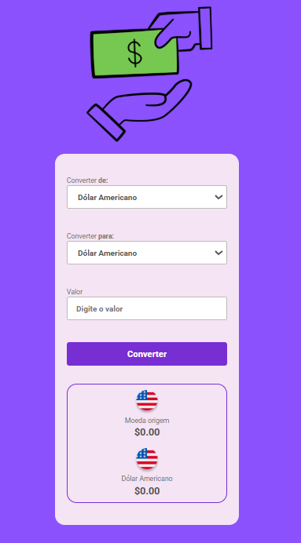

# 💱 Conversor de Moedas

Aplicação web simples para conversão de moedas, desenvolvida como parte de um projeto de curso.

## 📌 Sobre o projeto

O Conversor de Moedas permite ao usuário converter valores entre diferentes moedas de forma rápida e intuitiva.
O usuário seleciona a moeda de origem, a moeda de destino e insere o valor desejado para conversão.

## 🌐 Acesse o projeto

👉 [Clique aqui para acessar](https://feramos1987.github.io/Conversor-de-moedas-JS/)

## 🖼️ Preview

## 🚀 Funcionalidades

* Seleção de moeda de origem
* Seleção de moeda de destino
* Inserção de valor para conversão
* Exibição do resultado convertido
* Interface simples e amigável

## 🛠️ Tecnologias utilizadas

* HTML
* CSS
* JavaScript

## ▶️ Como usar

1. Selecione a moeda de origem (ex: Real)
2. Escolha a moeda de destino (ex: Dólar Americano)
3. Digite o valor desejado
4. Clique no botão **Converter**
5. Veja o resultado exibido na tela

## 🎯 Objetivo

Praticar conceitos fundamentais de desenvolvimento web, como:

* Manipulação do DOM
* Eventos em JavaScript
* Lógica de programação
* Criação de interfaces com HTML e CSS

## 📚 Aprendizados

Durante o desenvolvimento deste projeto, foram reforçados conhecimentos em:

* Interatividade com o usuário
* Estruturação de layouts
* Organização de código

---

✨ Projeto desenvolvido para fins de aprendizado.
